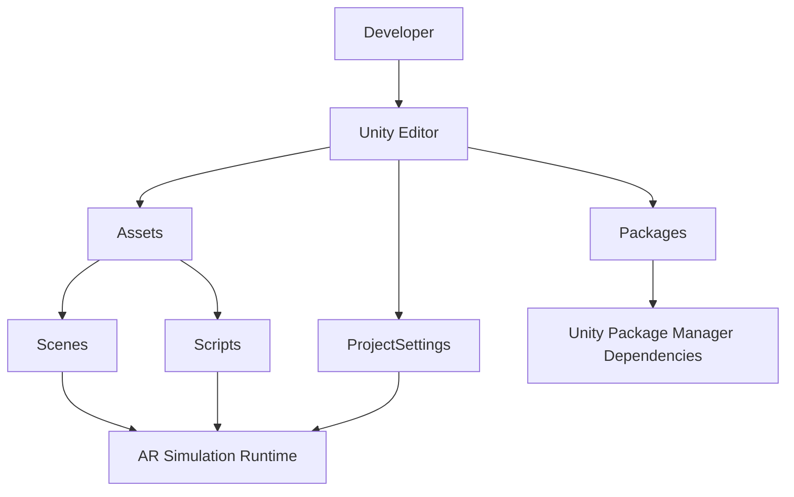
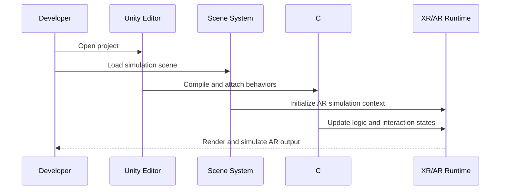
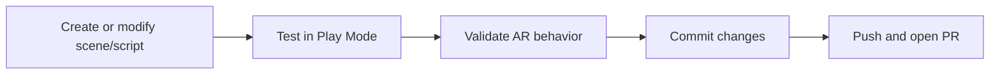

# Unity AR Simulation

A Unity-based augmented reality simulation project focused on rapid prototyping, scene testing, and XR workflow experimentation.

## Project Description (Quick View)
This repository contains a Unity AR simulation environment intended for experimenting with AR scenes, scripts, and project settings in a structured and reproducible way.

## Table of Contents
1. [Overview](#overview)
2. [Key Features](#key-features)
3. [System Architecture](#system-architecture)
4. [Project Structure](#project-structure)
5. [Technology Stack](#technology-stack)
6. [Getting Started](#getting-started)
7. [Build and Run](#build-and-run)
8. [Development Workflow](#development-workflow)
9. [Troubleshooting](#troubleshooting)
10. [Roadmap](#roadmap)
11. [Contributing](#contributing)
12. [License](#license)

---

## Overview
The project is organized as a standard Unity application with dedicated directories for assets, scenes, scripts, package dependencies, and project-level configuration. It is suitable for:

- AR simulation and concept validation
- Fast iteration on scene logic and scripts
- Testing Unity/XR project configurations
- Local development and team collaboration via version control

---

## Key Features
- Unity project scaffold ready for AR simulation workflows
- Isolated folder structure for scenes and scripts
- Managed package dependencies via Unity Package Manager
- Editable project settings for graphics, input, physics, XR, and build behavior
- Compatible with iterative development in Visual Studio Code or Visual Studio

---

## System Architecture



### Runtime Flow



---

## Project Structure

```text
Unity_AR_simulation/
├── Assets/
│   ├── Scenes/
│   └── Scripts/
├── Packages/
│   ├── manifest.json
│   └── packages-lock.json
├── ProjectSettings/
├── UserSettings/
├── Library/            # Generated by Unity (local cache)
├── Temp/               # Generated temporary files
├── Logs/               # Editor/import/build logs
├── Assembly-CSharp.csproj
├── hand_AR.sln
└── README.md
```

### Important Notes
- `Assets/` contains source assets you should version control.
- `Packages/manifest.json` defines Unity package dependencies.
- `ProjectSettings/` captures editor and runtime configuration.
- `Library/`, `Temp/`, and most `Logs/` content are generated artifacts.

---

## Technology Stack
- **Engine**: Unity
- **Language**: C#
- **Dependency Management**: Unity Package Manager (UPM)
- **IDE Support**: Visual Studio / VS Code
- **Version Control**: Git

---

## Getting Started

### Prerequisites
1. Unity Hub installed
2. A Unity Editor version matching `ProjectSettings/ProjectVersion.txt`
3. Git installed

### Setup Steps
1. Clone the repository:
   ```bash
   git clone <your-repository-url>
   cd Unity_AR_simulation
   ```
2. Open Unity Hub and add this project folder.
3. Launch the project with the recommended Unity Editor version.
4. Open a scene from `Assets/Scenes/`.
5. Press **Play** in Unity Editor to run the simulation.

---

## Build and Run

### Run in Editor
- Open the main simulation scene.
- Press **Play**.

### Build (General)
1. Open **File > Build Settings**.
2. Select target platform (Android, iOS, Windows, etc.).
3. Add required scenes to build.
4. Configure player settings and XR options.
5. Build and run.

---

## Development Workflow



### Suggested Branch Strategy
- `main`: stable branch
- `feature/<name>`: new features
- `fix/<name>`: bug fixes
- `chore/<name>`: maintenance

---

## Troubleshooting

### Unity version mismatch
- Check `ProjectSettings/ProjectVersion.txt` and install that editor version in Unity Hub.

### Packages not resolving
- Verify internet access and package registry settings.
- Reopen project to trigger package restore.
- Remove `Library/` (if safe) and reopen to force reimport.

### Scripts not compiling
- Check Console for C# errors.
- Ensure script class names match file names when required.
- Confirm API compatibility settings in Project Settings.

---

## Roadmap
- Add detailed scene-level documentation
- Add architecture notes for AR interaction systems
- Introduce automated validation checks
- Add platform-specific deployment guides

---

## Contributing
1. Fork and create a feature branch.
2. Keep commits focused and descriptive.
3. Open a pull request with:
   - What changed
   - Why it changed
   - How it was tested
4. Request review and address feedback.

---

## License
No license file is currently defined in this repository. Add a `LICENSE` file to specify usage and distribution terms.

---

## Optional Styled Presentation Layer (CSS + HTML)

> This section is additive and does not replace any existing README content.
> It provides an optional HTML/CSS version for platforms that support embedded styling.

### 1) Drop-in CSS Theme

```html
<style>
  :root {
    --bg: #0f172a;
    --card: #111827;
    --muted: #94a3b8;
    --text: #e5e7eb;
    --accent: #22d3ee;
    --accent-2: #38bdf8;
    --ok: #34d399;
    --warn: #f59e0b;
    --border: #1f2937;
  }

  .ar-wrap {
    max-width: 980px;
    margin: 1.25rem auto;
    padding: 1rem;
    color: var(--text);
    background: radial-gradient(1200px 500px at 20% -20%, rgba(56,189,248,.18), transparent 60%),
                radial-gradient(900px 420px at 110% 10%, rgba(34,211,238,.16), transparent 55%),
                var(--bg);
    border: 1px solid var(--border);
    border-radius: 16px;
    font-family: Inter, Segoe UI, Roboto, Helvetica, Arial, sans-serif;
  }

  .ar-hero {
    display: grid;
    gap: .75rem;
    padding: 1rem;
    border: 1px solid var(--border);
    border-radius: 14px;
    background: linear-gradient(180deg, rgba(56,189,248,.08), rgba(34,211,238,.04));
  }

  .ar-title {
    margin: 0;
    font-size: 1.8rem;
    letter-spacing: .2px;
  }

  .ar-sub {
    margin: 0;
    color: var(--muted);
    line-height: 1.5;
  }

  .ar-grid {
    margin-top: 1rem;
    display: grid;
    grid-template-columns: repeat(auto-fit, minmax(220px, 1fr));
    gap: .75rem;
  }

  .ar-card {
    border: 1px solid var(--border);
    border-radius: 12px;
    padding: .85rem;
    background: var(--card);
  }

  .ar-card h4 {
    margin: 0 0 .45rem 0;
    color: var(--accent);
    font-size: 1rem;
  }

  .ar-card p,
  .ar-card ul {
    margin: 0;
    color: var(--text);
    line-height: 1.5;
    font-size: .95rem;
  }

  .ar-tags {
    display: flex;
    flex-wrap: wrap;
    gap: .45rem;
    margin-top: .6rem;
  }

  .ar-tag {
    border: 1px solid var(--border);
    border-radius: 999px;
    padding: .25rem .55rem;
    font-size: .8rem;
    color: var(--text);
    background: rgba(148,163,184,.1);
  }

  .ar-status {
    margin-top: 1rem;
    border-left: 3px solid var(--ok);
    padding: .55rem .7rem;
    background: rgba(52,211,153,.08);
    border-radius: 8px;
    font-size: .92rem;
  }

  .ar-note {
    margin-top: .75rem;
    border-left: 3px solid var(--warn);
    padding: .55rem .7rem;
    background: rgba(245,158,11,.08);
    border-radius: 8px;
    font-size: .9rem;
    color: var(--muted);
  }
</style>
```

### 2) Optional Styled Header Block

```html
<div class="ar-wrap">
  <section class="ar-hero">
    <h2 class="ar-title">Unity AR Simulation</h2>
    <p class="ar-sub">
      A Unity-based augmented reality simulation project for rapid prototyping,
      scene testing, and XR workflow experimentation.
    </p>
    <div class="ar-tags">
      <span class="ar-tag">Unity</span>
      <span class="ar-tag">C#</span>
      <span class="ar-tag">XR/AR</span>
      <span class="ar-tag">UPM</span>
    </div>
  </section>

  <section class="ar-grid">
    <article class="ar-card">
      <h4>Purpose</h4>
      <p>Prototype and validate AR scene behavior with predictable project structure.</p>
    </article>
    <article class="ar-card">
      <h4>Architecture</h4>
      <p>Assets, scripts, and project settings converge into runtime AR simulation.</p>
    </article>
    <article class="ar-card">
      <h4>Workflow</h4>
      <p>Edit, run in Play Mode, validate behavior, then commit and publish.</p>
    </article>
  </section>

  <div class="ar-status">
    Documentation is actively structured for onboarding, local setup, and repeatable development.
  </div>

  <div class="ar-note">
    Note: Some platforms sanitize inline CSS in Markdown rendering. If so, keep this as a reference snippet for docs sites.
  </div>
</div>
```

### 3) Optional Visual Section Divider Style

```html
<hr style="border: 0; height: 1px; background: linear-gradient(90deg, transparent, #38bdf8, transparent); margin: 1.2rem 0;" />
```

### 4) Styled Quick Facts Panel

```html
<table>
  <tr>
    <td><strong>Engine</strong></td>
    <td>Unity</td>
  </tr>
  <tr>
    <td><strong>Primary Language</strong></td>
    <td>C#</td>
  </tr>
  <tr>
    <td><strong>Dependency Manager</strong></td>
    <td>Unity Package Manager</td>
  </tr>
  <tr>
    <td><strong>Main Goal</strong></td>
    <td>AR simulation and experimentation</td>
  </tr>
</table>
```

---

## Git Merge Conflict Quick Fix

If you see a merge conflict while pulling or merging branches, use this workflow:

1. Check conflicted files:
   ```bash
   git status
   ```
2. Open each conflicted file and resolve markers:
   - `<<<<<<< HEAD`
   - `=======`
   - `>>>>>>> branch-name`
3. Keep the correct final content and remove all conflict marker lines.
4. Mark files as resolved:
   ```bash
   git add <resolved-file>
   ```
5. Finish the merge:
   ```bash
   git commit
   ```
6. Verify:
   ```bash
   git status
   ```

### If conflict is only in README

Use this helper flow to keep both sides and then edit:

```bash
git checkout --conflict=merge README.md
# manually edit README.md to final version
git add README.md
git commit
```

---

## Live Styled Preview (Rendered in README)

<div style="max-width:980px;margin:16px auto;padding:18px;border:1px solid #1f2937;border-radius:14px;background:linear-gradient(180deg,#0f172a,#111827);color:#e5e7eb;font-family:Segoe UI,Roboto,Arial,sans-serif;">
  <div style="padding:14px;border:1px solid #334155;border-radius:12px;background:linear-gradient(180deg,rgba(56,189,248,0.12),rgba(34,211,238,0.06));">
    <h3 style="margin:0 0 8px 0;color:#e2e8f0;">Unity AR Simulation</h3>
    <p style="margin:0;color:#cbd5e1;line-height:1.5;">
      Unity-based augmented reality simulation for rapid prototyping, scene validation, and XR workflow testing.
    </p>
    <div style="margin-top:10px;display:flex;flex-wrap:wrap;gap:8px;">
      <span style="padding:4px 10px;border:1px solid #334155;border-radius:999px;background:#0b1220;color:#bae6fd;font-size:12px;">Unity</span>
      <span style="padding:4px 10px;border:1px solid #334155;border-radius:999px;background:#0b1220;color:#bae6fd;font-size:12px;">C#</span>
      <span style="padding:4px 10px;border:1px solid #334155;border-radius:999px;background:#0b1220;color:#bae6fd;font-size:12px;">AR/XR</span>
      <span style="padding:4px 10px;border:1px solid #334155;border-radius:999px;background:#0b1220;color:#bae6fd;font-size:12px;">UPM</span>
    </div>
  </div>

  <div style="display:grid;grid-template-columns:repeat(auto-fit,minmax(210px,1fr));gap:10px;margin-top:12px;">
    <div style="border:1px solid #334155;border-radius:10px;padding:10px;background:#0b1220;">
      <strong style="color:#67e8f9;">Purpose</strong>
      <p style="margin:6px 0 0 0;color:#cbd5e1;line-height:1.45;">Build and iterate AR scene behavior in a clean Unity project scaffold.</p>
    </div>
    <div style="border:1px solid #334155;border-radius:10px;padding:10px;background:#0b1220;">
      <strong style="color:#67e8f9;">Architecture</strong>
      <p style="margin:6px 0 0 0;color:#cbd5e1;line-height:1.45;">Assets, scripts, and settings feed runtime AR simulation flow.</p>
    </div>
    <div style="border:1px solid #334155;border-radius:10px;padding:10px;background:#0b1220;">
      <strong style="color:#67e8f9;">Workflow</strong>
      <p style="margin:6px 0 0 0;color:#cbd5e1;line-height:1.45;">Edit, Play Mode test, validate, commit, and open PR.</p>
    </div>
  </div>

  <div style="margin-top:12px;padding:10px 12px;border-left:3px solid #34d399;background:rgba(52,211,153,0.12);border-radius:8px;color:#d1fae5;">
    This block uses inline CSS directly in README HTML, so styles are applied without external CSS files.
  </div>
</div>
