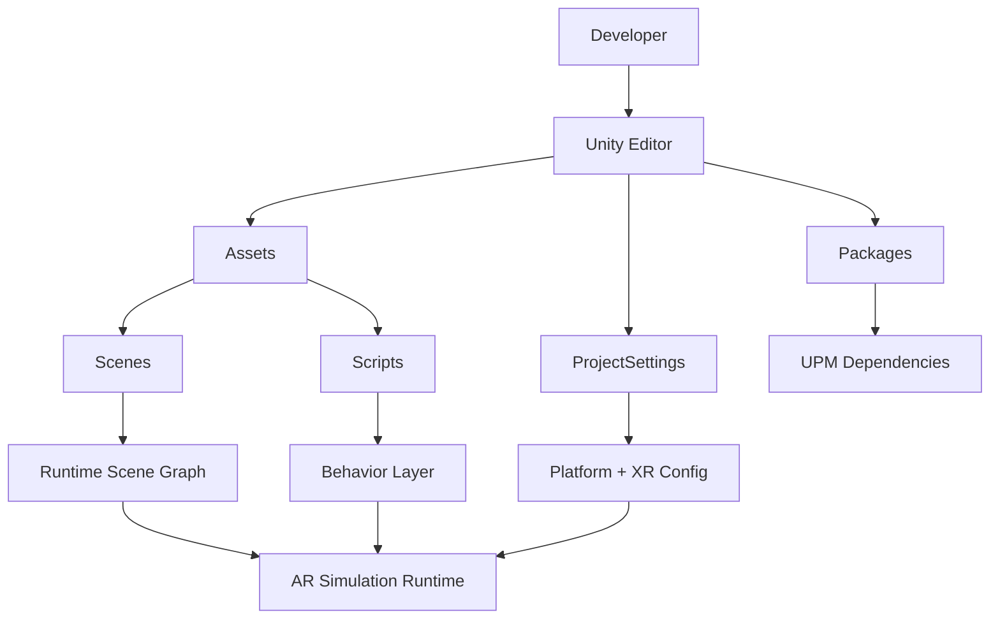
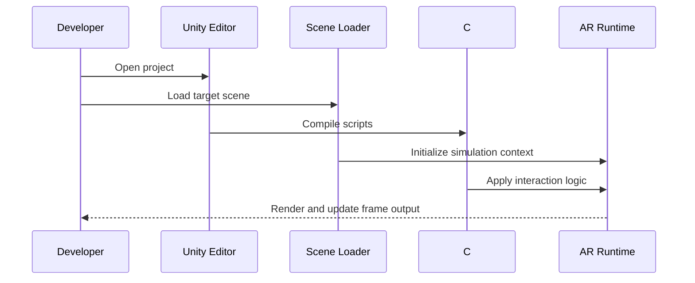
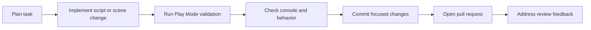

# Unity AR Simulation

A production-ready Unity project template for building, validating, and iterating augmented reality experiences with clear architecture, reproducible setup, and contributor-friendly workflows.

## Project Description
Unity AR Simulation is designed as a practical foundation for AR/XR prototyping. It combines a standard Unity project layout with structured documentation so contributors can quickly open the project, understand where logic lives, and start shipping scene and interaction improvements with confidence.

---

## Table of Contents
1. [Why This Project Exists](#why-this-project-exists)
2. [Core Capabilities](#core-capabilities)
3. [System Architecture](#system-architecture)
4. [Runtime Lifecycle](#runtime-lifecycle)
5. [Repository Structure](#repository-structure)
6. [Technical Stack](#technical-stack)
7. [Prerequisites](#prerequisites)
8. [Quick Start](#quick-start)
9. [Build and Deployment](#build-and-deployment)
10. [Configuration Guide](#configuration-guide)
11. [Development Workflow](#development-workflow)
12. [Quality and Validation Checklist](#quality-and-validation-checklist)
13. [Troubleshooting Guide](#troubleshooting-guide)
14. [Performance Notes for AR](#performance-notes-for-ar)
15. [Security and Repo Hygiene](#security-and-repo-hygiene)
16. [Roadmap](#roadmap)
17. [Contributing](#contributing)
18. [License](#license)

---

## Why This Project Exists
AR projects often lose time on setup friction, package mismatch, and undocumented scene logic. This repository is structured to solve that by providing:

- A predictable Unity folder architecture
- Clear setup and execution steps
- Shared conventions for branch and commit workflows
- Easy onboarding for new collaborators
- Repeatable scene testing and AR iteration loops

---

## Core Capabilities
- Unity-based AR simulation workspace for rapid prototyping
- Dedicated scene and script directories for clean organization
- Unity Package Manager-driven dependency control
- Project-level configuration for graphics, input, physics, and XR
- IDE-friendly C# project/solution files for local development

---

## System Architecture



### Architectural Notes
- **Assets/Scenes**: Visual and interaction context loaded during simulation.
- **Assets/Scripts**: C# logic driving behaviors and state updates.
- **ProjectSettings**: Centralized Unity configuration that affects editor and runtime behavior.
- **Packages/manifest.json**: Source of truth for package dependencies.

---

## Runtime Lifecycle



---

## Repository Structure

```text
Unity_AR_simulation/
├── Assets/
│   ├── Scenes/
│   └── Scripts/
├── Packages/
│   ├── manifest.json
│   └── packages-lock.json
├── ProjectSettings/
├── UserSettings/
├── Library/                 # Unity-generated local cache
├── Temp/                    # Unity temporary files
├── Logs/                    # Editor/import logs
├── Assembly-CSharp.csproj
├── hand_AR.sln
└── README.md
```

### Directory Ownership Guidelines
- Version control **source directories** (`Assets`, `Packages`, `ProjectSettings`).
- Avoid committing machine-local generated caches unless explicitly required.
- Keep scenes and scripts modular to simplify reviews and merges.

---

## Technical Stack
- **Engine**: Unity
- **Language**: C#
- **XR/AR Base**: Unity XR ecosystem (configured via project/package settings)
- **Dependency Management**: Unity Package Manager
- **IDE Support**: Visual Studio / VS Code
- **VCS**: Git

---

## Prerequisites
1. Unity Hub
2. Unity Editor version matching `ProjectSettings/ProjectVersion.txt`
3. Git
4. A supported development IDE (VS/VS Code)

---

## Quick Start
1. Clone the repository:
   ```bash
   git clone <repository-url>
   cd Unity_AR_simulation
   ```
2. Open Unity Hub, then **Add project from disk**.
3. Select this repository root.
4. Launch with the matching Unity Editor version.
5. Open a scene from `Assets/Scenes/`.
6. Press **Play** to run the AR simulation loop.

---

## Build and Deployment

### Run in Editor
- Open the primary scene.
- Enter Play Mode and validate interactions.

### Build Pipeline (General)
1. Open **File > Build Settings**.
2. Select target platform.
3. Add all required scenes to **Scenes In Build**.
4. Configure **Player Settings** and XR options.
5. Build and run on target device/emulator.

### Release Checklist
- Confirm correct Unity editor version.
- Confirm packages resolved without warning.
- Confirm scene list and bootstrap scene ordering.
- Confirm scripting backend/API compatibility.
- Confirm target platform permissions and capabilities.

---

## Configuration Guide

### Important Files
- `Packages/manifest.json`: controls package dependencies.
- `Packages/packages-lock.json`: lockfile for reproducibility.
- `ProjectSettings/ProjectVersion.txt`: expected Unity version.
- `ProjectSettings/*.asset`: graphics, input, time, physics, XR behavior.

### Recommended Configuration Discipline
- Change one config domain at a time (e.g., input, graphics, XR).
- Validate in editor immediately after each config change.
- Keep config commits isolated for easier rollback.

---

## Development Workflow



### Branch Naming
- `feature/<short-name>`
- `fix/<short-name>`
- `chore/<short-name>`
- `docs/<short-name>`

### Commit Style
Use precise, imperative commit messages:
- `Add hand gesture interaction bootstrap`
- `Fix scene initialization order for AR session`
- `Document build settings for Android target`

---

## Quality and Validation Checklist
Before opening a PR:

- Project opens with no package resolution errors
- Target scenes load successfully
- Console is free of new errors
- Behavioral changes validated in Play Mode
- README/docs updated when workflow changes
- Commits are scoped and reviewable

---

## Troubleshooting Guide

### Unity Version Mismatch
- Symptom: project upgrade prompt or serialization issues.
- Fix: install exact version from `ProjectSettings/ProjectVersion.txt` and reopen.

### Package Restore Failures
- Symptom: missing namespaces or unresolved package warnings.
- Fix: verify network/registry access, reopen project, and if needed rebuild local cache.

### C# Compilation Errors
- Symptom: scripts not entering Play Mode.
- Fix: resolve Console errors, class/file naming consistency, and API compatibility settings.

### Unexpected Scene Behavior
- Symptom: objects not initializing in expected order.
- Fix: verify scene hierarchy, script execution dependencies, and serialized references.

---

## Performance Notes for AR
- Favor lightweight shaders and optimized materials.
- Keep update loops focused and avoid unnecessary allocations.
- Profile in-device when possible; editor performance can differ from target hardware.
- Reduce scene overdraw and expensive post-processing for mobile targets.

---

## Security and Repo Hygiene
- Do not commit secrets, private keys, or service credentials.
- Keep generated local artifacts out of versioned changes.
- Review changes to `ProjectSettings` and `Packages` carefully as they affect all contributors.

---

## Roadmap
- Expand scene-level design documentation
- Add platform-specific deployment guides
- Introduce automated validation scripts for project health checks
- Add AR interaction architecture examples

---

## Contributing
1. Create a branch from your latest `main`.
2. Keep changes focused to one concern per PR.
3. Include:
   - What changed
   - Why it changed
   - How you validated it
4. Address review feedback promptly.
5. Rebase/merge cleanly and keep history understandable.

---

## License
A license file is not currently present. Add `LICENSE` at repository root to define usage, redistribution, and contribution terms.
