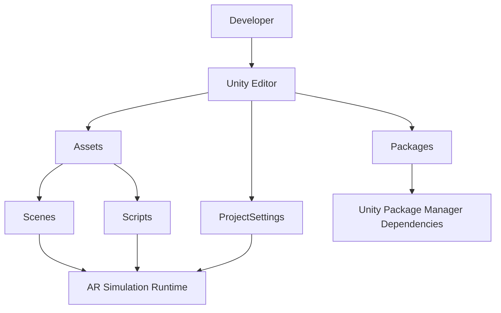
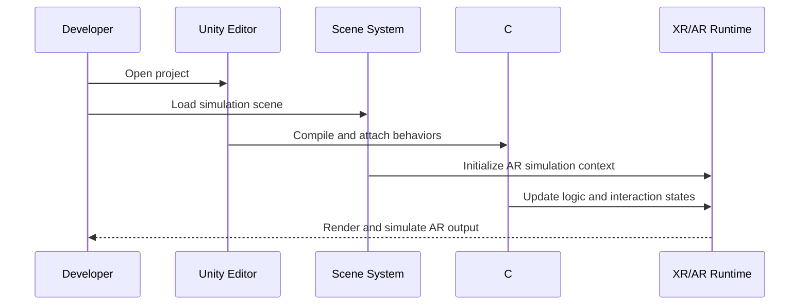
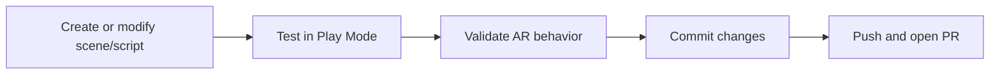

# Unity AR Simulation

A Unity-based augmented reality simulation project focused on rapid prototyping, scene testing, and XR workflow experimentation.

## Project Description (Quick View)
This repository contains a Unity AR simulation environment intended for experimenting with AR scenes, scripts, and project settings in a structured and reproducible way.

## Table of Contents
1. [Overview](#overview)
2. [Key Features](#key-features)
3. [System Architecture](#system-architecture)
4. [Project Structure](#project-structure)
5. [Technology Stack](#technology-stack)
6. [Getting Started](#getting-started)
7. [Build and Run](#build-and-run)
8. [Development Workflow](#development-workflow)
9. [Troubleshooting](#troubleshooting)
10. [Roadmap](#roadmap)
11. [Contributing](#contributing)
12. [License](#license)

---

## Overview
The project is organized as a standard Unity application with dedicated directories for assets, scenes, scripts, package dependencies, and project-level configuration. It is suitable for:

- AR simulation and concept validation
- Fast iteration on scene logic and scripts
- Testing Unity/XR project configurations
- Local development and team collaboration via version control

---

## Key Features
- Unity project scaffold ready for AR simulation workflows
- Isolated folder structure for scenes and scripts
- Managed package dependencies via Unity Package Manager
- Editable project settings for graphics, input, physics, XR, and build behavior
- Compatible with iterative development in Visual Studio Code or Visual Studio

---

## System Architecture



### Runtime Flow



---

## Project Structure

```text
Unity_AR_simulation/
├── Assets/
│   ├── Scenes/
│   └── Scripts/
├── Packages/
│   ├── manifest.json
│   └── packages-lock.json
├── ProjectSettings/
├── UserSettings/
├── Library/            # Generated by Unity (local cache)
├── Temp/               # Generated temporary files
├── Logs/               # Editor/import/build logs
├── Assembly-CSharp.csproj
├── hand_AR.sln
└── README.md
```

### Important Notes
- `Assets/` contains source assets you should version control.
- `Packages/manifest.json` defines Unity package dependencies.
- `ProjectSettings/` captures editor and runtime configuration.
- `Library/`, `Temp/`, and most `Logs/` content are generated artifacts.

---

## Technology Stack
- **Engine**: Unity
- **Language**: C#
- **Dependency Management**: Unity Package Manager (UPM)
- **IDE Support**: Visual Studio / VS Code
- **Version Control**: Git

---

## Getting Started

### Prerequisites
1. Unity Hub installed
2. A Unity Editor version matching `ProjectSettings/ProjectVersion.txt`
3. Git installed

### Setup Steps
1. Clone the repository:
   ```bash
   git clone <your-repository-url>
   cd Unity_AR_simulation
   ```
2. Open Unity Hub and add this project folder.
3. Launch the project with the recommended Unity Editor version.
4. Open a scene from `Assets/Scenes/`.
5. Press **Play** in Unity Editor to run the simulation.

---

## Build and Run

### Run in Editor
- Open the main simulation scene.
- Press **Play**.

### Build (General)
1. Open **File > Build Settings**.
2. Select target platform (Android, iOS, Windows, etc.).
3. Add required scenes to build.
4. Configure player settings and XR options.
5. Build and run.

---

## Development Workflow



### Suggested Branch Strategy
- `main`: stable branch
- `feature/<name>`: new features
- `fix/<name>`: bug fixes
- `chore/<name>`: maintenance

---

## Troubleshooting

### Unity version mismatch
- Check `ProjectSettings/ProjectVersion.txt` and install that editor version in Unity Hub.

### Packages not resolving
- Verify internet access and package registry settings.
- Reopen project to trigger package restore.
- Remove `Library/` (if safe) and reopen to force reimport.

### Scripts not compiling
- Check Console for C# errors.
- Ensure script class names match file names when required.
- Confirm API compatibility settings in Project Settings.

---

## Roadmap
- Add detailed scene-level documentation
- Add architecture notes for AR interaction systems
- Introduce automated validation checks
- Add platform-specific deployment guides

---

## Contributing
1. Fork and create a feature branch.
2. Keep commits focused and descriptive.
3. Open a pull request with:
   - What changed
   - Why it changed
   - How it was tested
4. Request review and address feedback.

---

## License
No license file is currently defined in this repository. Add a `LICENSE` file to specify usage and distribution terms.
